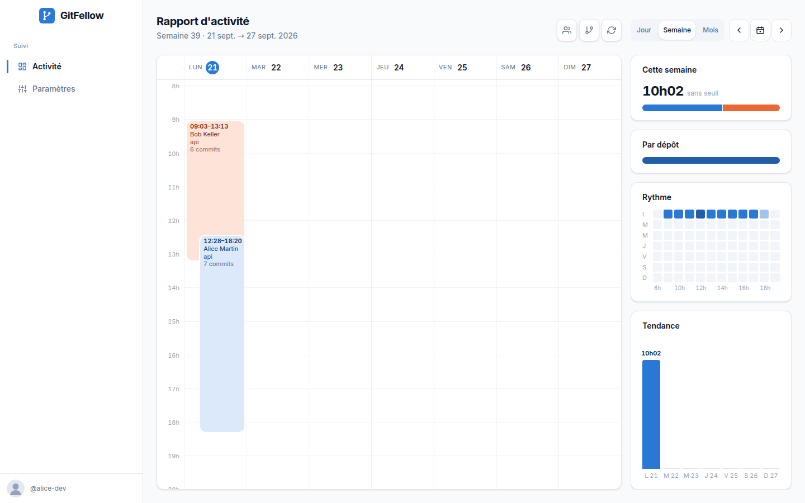
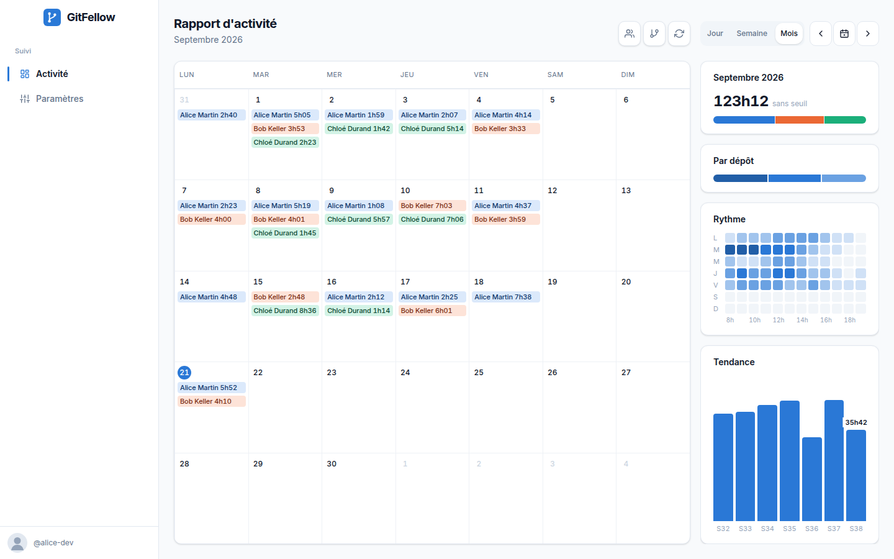
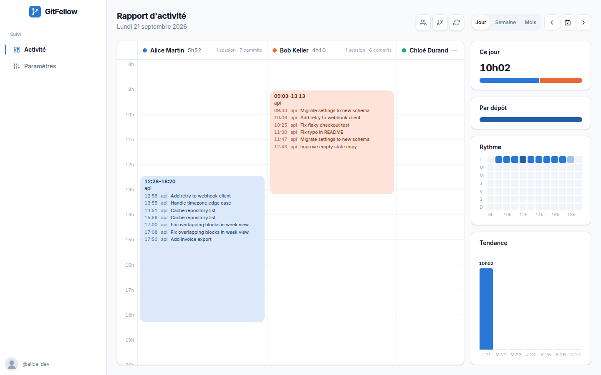
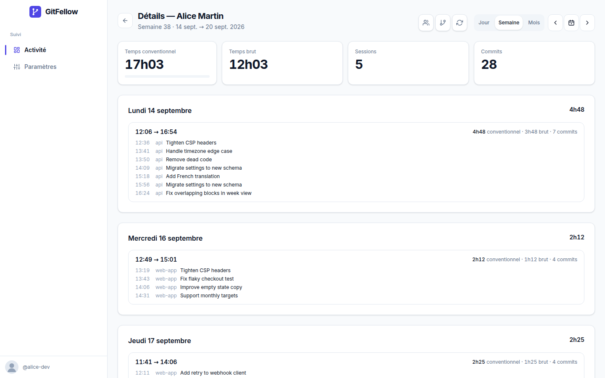
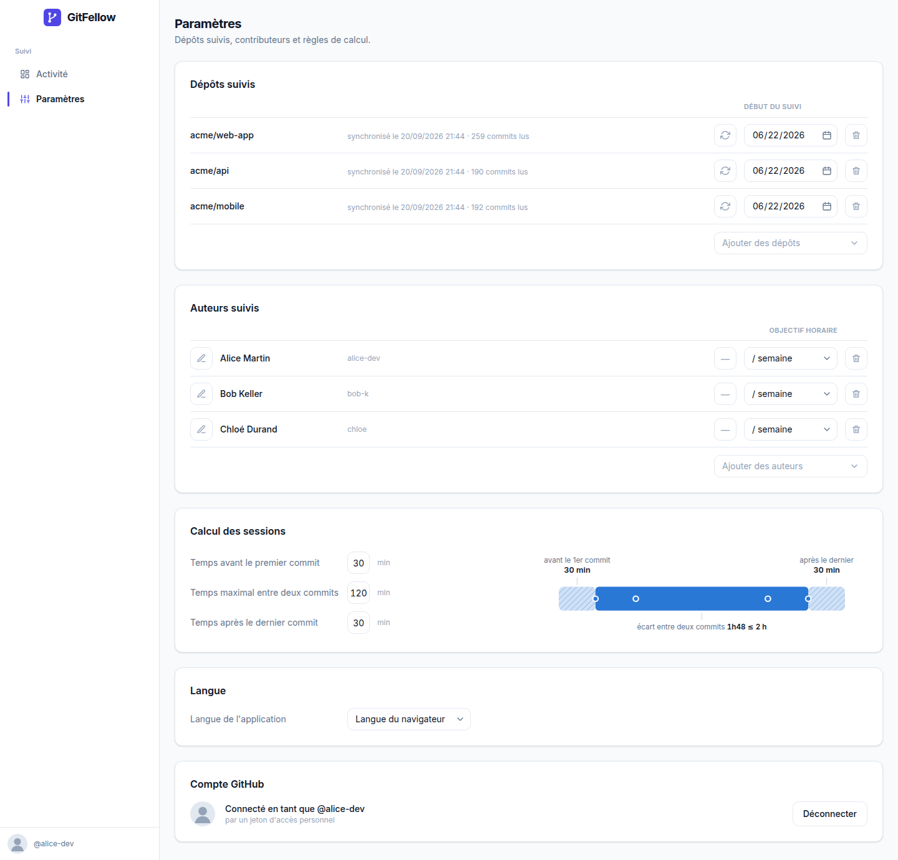

# GitFellow

**Voyez où passe le temps de votre équipe sur GitHub.** GitFellow lit les commits des dépôts que vous choisissez, les regroupe en sessions de travail et montre, par personne et par semaine, combien de temps est allé dans chaque projet — sur votre machine, sans compte à créer ni serveur à faire tourner.

_[English version →](README.md)_



## Installation en deux étapes

1. **Installez Node.js** (LTS) depuis [nodejs.org](https://nodejs.org) — un installeur classique, Suivant, Suivant, Terminer. GitFellow demande la version 22.13 ou plus récente.
2. Ouvrez un terminal et tapez :

   ```sh
   npx gitfellow
   ```

Votre navigateur s'ouvre sur l'assistant d'installation :

| 1 · Connecter GitHub | 2 · Choisir les dépôts | 3 · Première synchronisation |
|---|---|---|
|  |  |  |

1. **Connecter GitHub** — soit *Se connecter avec GitHub* (un code à saisir sur github.com, rien d'autre), soit un jeton d'accès personnel à coller. GitFellow le vérifie auprès de GitHub et le garde sur cette machine seulement.
2. **Choisir les dépôts** — cochez-les dans la liste de votre compte, organisations comprises. Les commits antérieurs à la date de *début du suivi* sont ignorés (trois mois en arrière par défaut ; vide, tout l'historique est lu).
3. **Première synchronisation** — GitFellow lit les commits, puis met sous suivi les auteurs qu'il a trouvés. Ouvrez le rapport : il a déjà quelque chose à montrer.

La fois suivante, relancez la même commande : GitFellow rattrape ce qui s'est passé pendant qu'il était fermé, puis se resynchronise toutes les 15 minutes tant qu'il tourne. Tout vit dans `~/.gitfellow` (la base et la connexion GitHub).

```
npx gitfellow --port 5000      # un port fixe (défaut : le premier libre à partir de 4747)
npx gitfellow --no-open        # sans ouvrir le navigateur
npx gitfellow --data-dir DIR   # un autre dossier de données
```

## Ce que vous obtenez

| | |
|---|---|
|  |  |
| **Vue Mois** — une puce par personne et par jour, le cumul du mois face aux objectifs. | **Vue Jour** — une colonne par personne, les sessions à leur heure réelle, les commits listés dedans. |
|  |  |
| **La fiche d'une personne** — temps conventionnel et brut, sessions et commits de la période, puis le détail jour par jour. | **Paramètres** — dépôts suivis, auteurs suivis avec leur objectif facultatif (par jour, semaine ou mois), règles de calcul, langue. |

- **Rapport d'activité** en vue Jour, Semaine ou Mois, une couleur par personne, chaque session à son heure réelle. La colonne de droite empile le cumul de la période avec sa jauge, la répartition par dépôt, le rythme jour × heure et la tendance ; le survol donne les chiffres.
- **Filtres** par personnes et par dépôts, conservés d'une vue et d'une page à l'autre.
- **Objectifs** — facultatifs, par personne : des heures par jour, par semaine ou par mois. Quelle que soit l'unité, l'objectif est ramené à des heures par jour ouvré et comparé à la période.
- **Les couleurs suivent les données** — l'interface reste indigo ; le rapport prend une teinte par page : celle de la personne quand elle est seule à l'écran, le bleu de données sinon.
- **Export CSV** des sessions d'une personne : `/api/export?contributor=<id>&week=2026-W38` (ou des dates `from`/`to`).
- **Deux langues** — français et anglais, selon le navigateur, ou fixée dans les Paramètres.

## Comment l'estimation est faite

Chaque commit, sur toutes les branches de chaque dépôt suivi, est un événement daté de sa **date auteur**. Les événements d'une personne sont regroupés en **sessions** :

| Règle | Défaut | Sens |
|---|---|---|
| Temps avant le premier commit | 30 min | la session commence 30 minutes avant son premier commit |
| Temps maximal entre deux commits | 120 min | deux commits séparés d'au plus 2 heures appartiennent à la même session |
| Temps après le dernier commit | 30 min | la session se termine 30 minutes après son dernier commit |

Des commits lundi à 9h54, 10h12, 12h00, 13h39, 16h00, 17h00, 23h00 et mardi 0h39 donnent trois sessions — 9h24 → 14h09, 15h30 → 17h30 et 22h30 → 1h09 — soit 9 h 24 au total. Une session est rattachée au jour et à la semaine ISO de son début, dans le fuseau de votre machine. Changer une règle recalcule tout l'historique : rien n'est stocké hormis les commits.

Un commit est attribué à une personne par son login GitHub, puis par l'e-mail, puis par le nom d'auteur. Les commits signés par un agent (par exemple `Claude <noreply@anthropic.com>`) sont attribués à **l'auteur de la pull request** qui les contient.

**À garder en tête**

- C'est un **plancher** : lecture, conception, tests, réunions ne produisent pas de commit. À l'inverse, une pause entre deux commits rapprochés est comptée.
- Les dates de commit viennent de la machine du développeur (modifiables, décalées par un rebase).
- Les tampons pèsent lourd quand les sessions sont courtes et nombreuses : la fiche affiche toujours le temps brut à côté du temps conventionnel.
- Un squash merge efface l'historique fin : conservez les merges classiques sur les dépôts suivis.

## Confidentialité

Rien ne quitte votre machine, hormis les appels à l'API GitHub, faits avec votre propre compte. Le jeton vit dans `~/.gitfellow/config.json`, lisible par vous seul ; la base à côté, de même. Pas de télémétrie, pas de compte, pas de serveur : l'application ne répond que sur `localhost` et refuse tout autre nom d'hôte.

Le rapport porte sur le temps de travail de vos collègues : ce sont aussi leurs données. Convenez avec eux de ce que vous suivez et pourquoi, et gardez une date de début de suivi honnête.

## Pour les mainteneurs

```sh
git clone https://github.com/MHermand/GitFellow && cd GitFellow
npm install
npm run dev            # http://localhost:3000
npm test               # Vitest : sessions, calendrier, rapport, store, synchro, i18n
npm run lint && npm run typecheck
```

- **Stack** — Next.js 16 (App Router), React 19, TypeScript, Tailwind CSS 4, SQLite via `node:sqlite` (livré avec Node, rien à compiler). La couche de calcul (`src/lib`) est pure et testée ; le stockage est derrière une interface `Store` (`src/lib/store`) avec une implémentation SQLite.
- **Essayer sans compte GitHub** — `GITFELLOW_FAKE_GITHUB=1 npm run dev` remplace GitHub par trois dépôts et huit semaines de commits inventés. Les captures ci-dessus en viennent : `node scripts/pack.mjs && node scripts/screenshots.mjs` (après un `npx playwright install chromium`).
- **Activer « Se connecter avec GitHub »** — créez une OAuth App sur [github.com/settings/developers](https://github.com/settings/developers) en cochant *Enable Device Flow* (l'URL de callback ne sert pas), puis mettez son client ID dans `src/lib/github-app.ts` (ou passez `GITFELLOW_GITHUB_CLIENT_ID` au lancement, pour essayer sans toucher au fichier). L'ID est public ; le device flow n'a pas de secret. L'app demande la portée `repo`, la seule qui lise les dépôts privés. Sans lui, l'assistant ne propose que le jeton.
- **Publier** — `npm run pack` construit le serveur autonome dans `dist/` avec le lanceur et un `package.json` sans dépendance ; puis `cd dist && npm publish`. Le paquet pèse environ 4 Mo.
- **L'héberger pour une équipe** (plus tard) — l'interface `Store` est faite pour recevoir une implémentation Postgres, et `GITFELLOW_ALLOW_ANY_HOST=1` lève la garde localhost ; il faudrait une couche d'authentification devant.

### Modèle de données

| Table | Contenu |
|---|---|
| `settings` | règles de calcul, fuseau, langue, intervalle de synchronisation (ligne unique) |
| `repos` | dépôts suivis, date de début de suivi, état de la dernière synchronisation |
| `contributors` | identités GitHub, objectif et son unité |
| `commits` | commits synchronisés (`repo_id + sha`), branches où ils apparaissent, pull request d'origine |

Les sessions ne sont jamais stockées : elles sont recalculées à chaque page à partir des commits et des règles courantes.

## Licence

MIT — voir [LICENSE](LICENSE).
