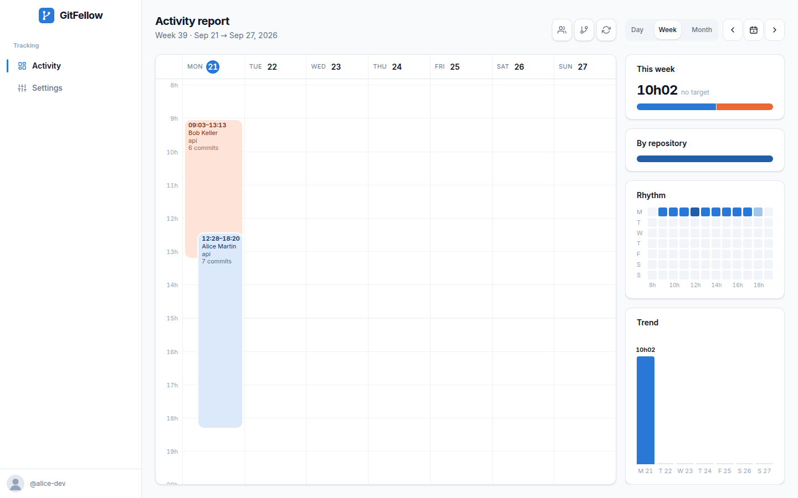
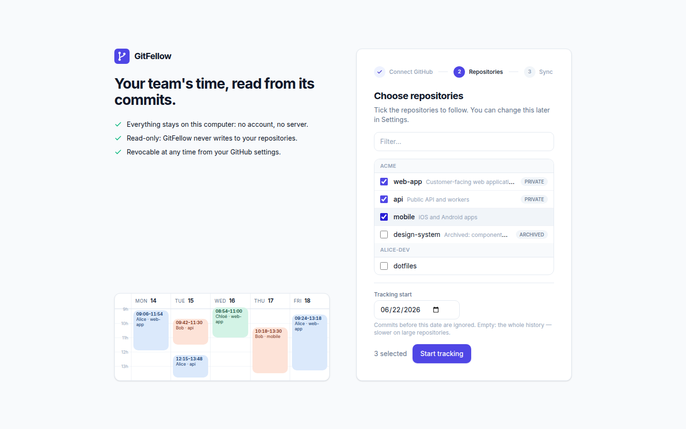
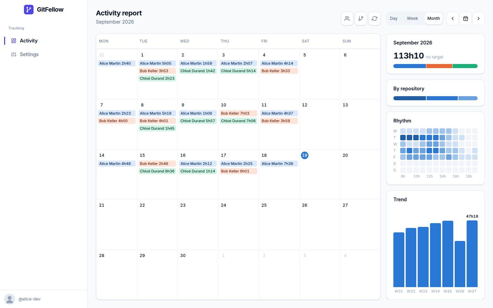
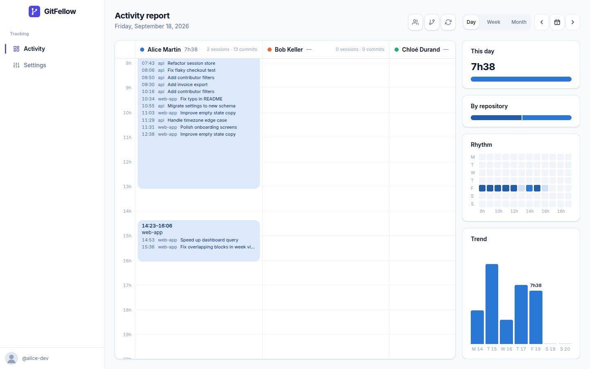
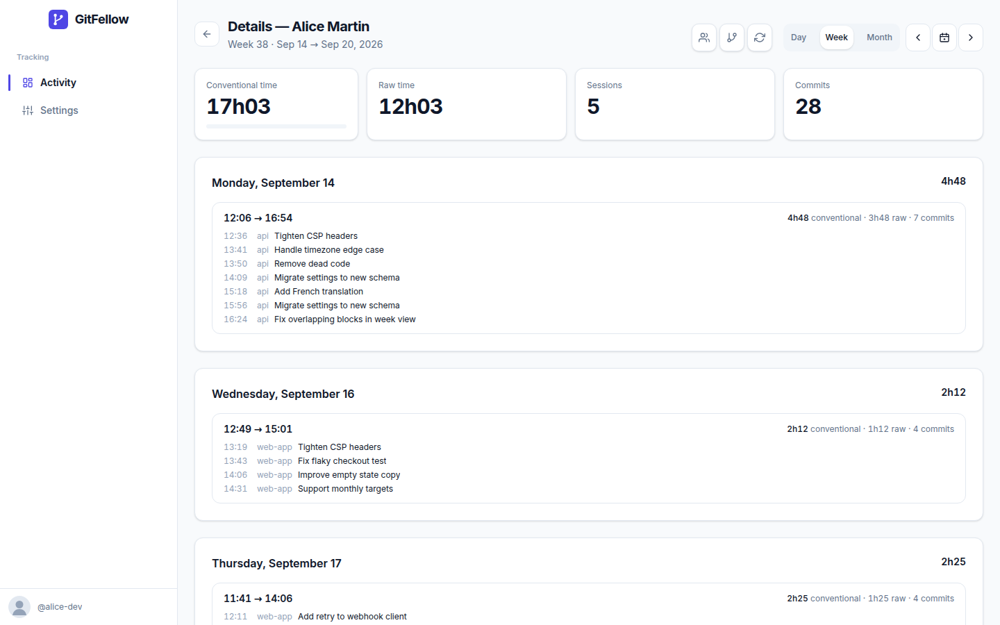
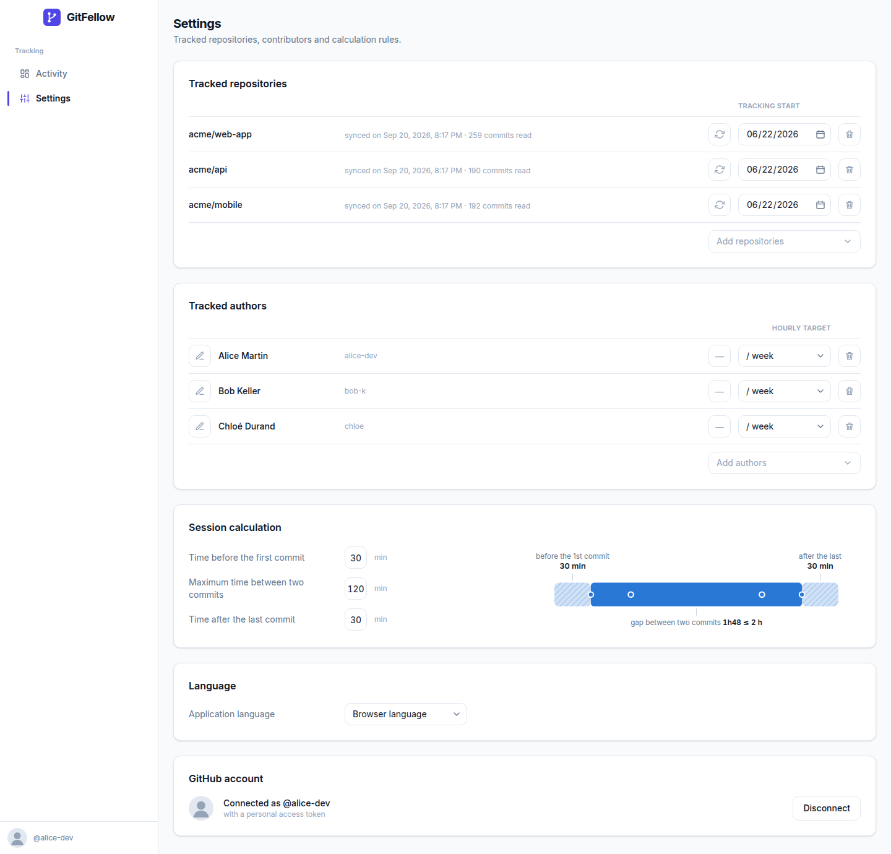

# GitFellow

**See where your team's time goes on GitHub.** GitFellow reads the commits of the repositories you choose, groups them into work sessions and shows, per person and per week, how much time went into each project — on your own machine, with no account to create and no server to run.

_[Version française →](README.fr.md)_



## Install in two steps

1. **Install Node.js** (LTS) from [nodejs.org](https://nodejs.org) — a regular installer, next, next, done. GitFellow needs version 22.13 or newer.
2. Open a terminal and type:

   ```sh
   npx gitfellow
   ```

Your browser opens on the setup assistant:

| 1 · Connect GitHub | 2 · Choose repositories | 3 · First sync |
|---|---|---|
|  |  |  |

1. **Connect GitHub** — either *Sign in with GitHub* (a code to type on github.com, nothing else) or a personal access token you paste. GitFellow checks it with GitHub and keeps it on this machine only.
2. **Choose repositories** — tick them in the list of your account, organisations included. Commits before the *tracking start* date are ignored (three months back by default; empty reads the whole history).
3. **First sync** — GitFellow reads the commits, then puts the authors it found under tracking. Open the report: it already has something to show.

Next time, run the same command: GitFellow catches up on what happened while it was closed, then keeps syncing every 15 minutes while it runs. Everything lives in `~/.gitfellow` (the database and the GitHub connection).

```
npx gitfellow --port 5000      # a fixed port (default: the first free one from 4747)
npx gitfellow --no-open        # do not open the browser
npx gitfellow --data-dir DIR   # another data folder
```

## What you get

| | |
|---|---|
|  |  |
| **Month view** — a chip per person and per day, the month's total against the targets. | **Day view** — one column per person, sessions at their real time, commits listed inside. |
|  |  |
| **A person's page** — conventional and raw time, sessions and commits for the period, then day by day. | **Settings** — tracked repositories, tracked authors with an optional target (per day, week or month), calculation rules, language. |

- **Activity report** in Day, Week or Month view, one colour per person, each session at its real hour. The right column stacks the period's total with its gauge, the split by repository, the day × hour rhythm and the trend; hovering any of them gives the figures.
- **Filters** by people and by repositories, kept across views and pages.
- **Targets** — optional, per person: hours per day, per week or per month. Whatever the unit, the target is brought back to hours per working day and compared with the period.
- **Colours follow the data** — the interface stays indigo; the report takes one hue per page: a person's colour when they are alone on screen, the data blue otherwise.
- **CSV export** of a person's sessions: `/api/export?contributor=<id>&week=2026-W38` (or `from`/`to` dates).
- **Two languages** — French and English, after your browser, or fixed in Settings.

## How the estimate works

Every commit, on every branch of every tracked repository, is an event with its **author date**. A person's events are grouped into **sessions**:

| Rule | Default | Meaning |
|---|---|---|
| Time before the first commit | 30 min | the session starts 30 minutes before its first commit |
| Maximum time between two commits | 120 min | two commits at most 2 hours apart belong to the same session |
| Time after the last commit | 30 min | the session ends 30 minutes after its last commit |

Commits on Monday at 9:54, 10:12, 12:00, 13:39, 16:00, 17:00, 23:00 and Tuesday 0:39 give three sessions — 9:24 → 14:09, 15:30 → 17:30 and 22:30 → 1:09 — 9 h 24 in all. A session belongs to the day and the ISO week it starts in, in your machine's time zone. Changing a rule recomputes the whole history: nothing is stored but the commits.

Commits are attributed to a person by GitHub login, then author e-mail, then author name. Commits signed by an agent (for example `Claude <noreply@anthropic.com>`) are attributed to the **author of the pull request** that contains them.

**Keep in mind**

- It is a **floor**: reading, design, tests, meetings produce no commit. Conversely, a break between two close commits is counted.
- Commit dates come from the developer's machine (editable, shifted by a rebase).
- Buffers weigh a lot when sessions are short and many: the person's page always shows the raw time next to the conventional one.
- A squash merge erases the fine history: keep regular merges on tracked repositories.

## Privacy

Nothing leaves your machine except the calls to the GitHub API, made with your own account. The token lives in `~/.gitfellow/config.json`, readable by you only; the database next to it, the same. There is no telemetry, no account, no server: the application only answers on `localhost` and refuses any other host name.

Since the report is about your colleagues' working time, it is their data too: agree with them on what you track and why, and keep the tracking start date honest.

## For maintainers

```sh
git clone https://github.com/MHermand/GitFellow && cd GitFellow
npm install
npm run dev            # http://localhost:3000
npm test               # Vitest: sessions, calendar, report, store, sync, i18n
npm run lint && npm run typecheck
```

- **Stack** — Next.js 16 (App Router), React 19, TypeScript, Tailwind CSS 4, SQLite through `node:sqlite` (shipped with Node, nothing to compile). The calculation layer (`src/lib`) is pure and tested; the storage layer is behind a `Store` interface (`src/lib/store`) with a SQLite implementation.
- **Try it without a GitHub account** — `GITFELLOW_FAKE_GITHUB=1 npm run dev` replaces GitHub with three repositories and eight weeks of made-up commits. The screenshots above come from it: `node scripts/pack.mjs && node scripts/screenshots.mjs` (after `npx playwright install chromium` once).
- **Enable “Sign in with GitHub”** — create an OAuth App on [github.com/settings/developers](https://github.com/settings/developers) with *Enable Device Flow* ticked (the callback URL is unused), then put its client ID in `src/lib/github-app.ts` (or `GITFELLOW_GITHUB_CLIENT_ID` at build time). The ID is public; there is no secret in the device flow. The app asks for the `repo` scope, the only one that reads private repositories. Without it, the assistant only offers the token.
- **Publish** — `npm run pack` builds the standalone server into `dist/` with the launcher and a dependency-free `package.json`; then `cd dist && npm publish`. The package weighs about 4 MB.
- **Hosting it for a team** (later) — the `Store` interface is meant to receive a Postgres implementation, and `GITFELLOW_ALLOW_ANY_HOST=1` lifts the localhost guard; an authentication layer would be needed in front.

### Data model

| Table | Content |
|---|---|
| `settings` | calculation rules, time zone, language, sync interval (single row) |
| `repos` | tracked repositories, tracking start date, last sync state |
| `contributors` | GitHub identities, target and its unit |
| `commits` | synced commits (`repo_id + sha`), branches they appear on, pull request of origin |

Sessions are never stored: they are recomputed from the commits and the current rules on every page.

## License

MIT — see [LICENSE](LICENSE).
